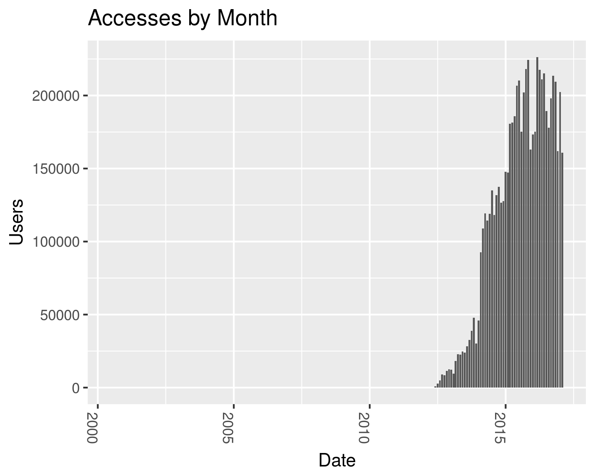
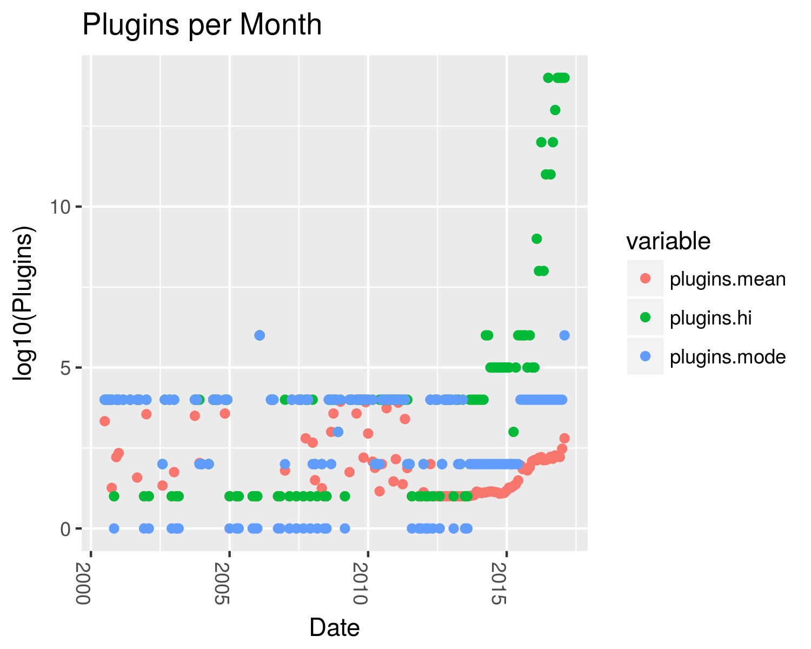
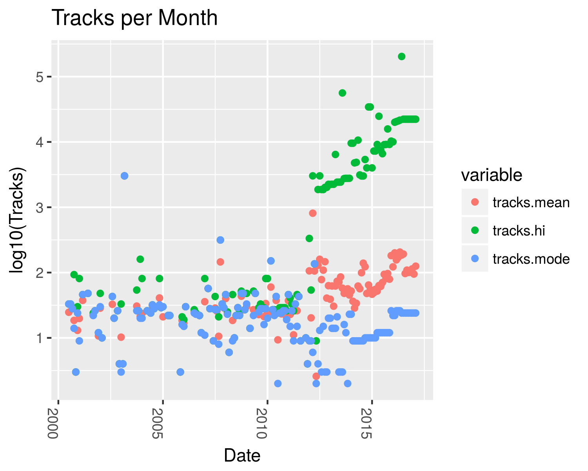
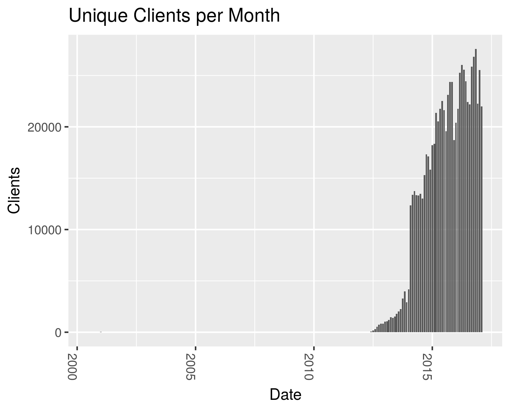
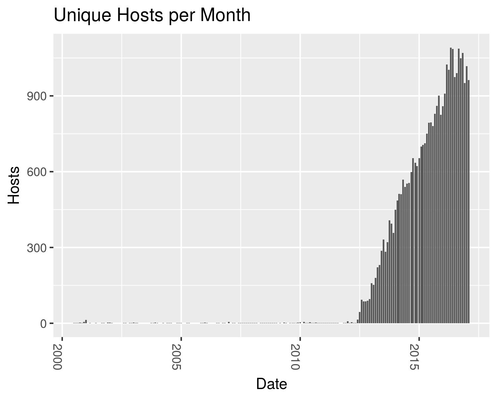

# JBrowse Analytics Reports







## Fetching Data

Assuming you have configured db.php according to db.sample.php:

```
make
```

## Building Charts

First, update date in charts.R and then run:

```
make charts
```

or

```
Rscript charts.R
```
